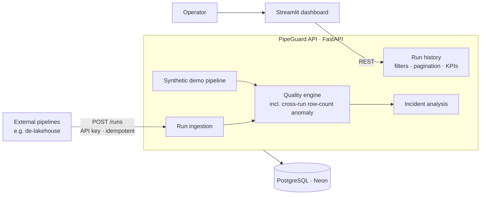

# PipeGuard

**Run monitoring for data pipelines.** Pipelines report each run to PipeGuard over an
authenticated API. It keeps their history, catches what a single run cannot see about
itself — such as a row count that collapsed compared with previous runs — and explains each
incident in terms of the check that failed.

It is the monitoring layer for
[de-lakehouse-pipeline](https://github.com/Ericliu-eng/de-lakehouse-pipeline), a market-data
warehouse: each run of its CLI orchestrator reports here with its row count and quality-check
results. A bundled synthetic pipeline makes every scenario reproducible on its own.

[](https://github.com/Ericliu-eng/pipeguard/actions/workflows/ci.yml)
· Tested on SQLite and PostgreSQL 18
· [Live dashboard](https://pipeguard-dashboard-iiub.onrender.com)
· [API docs](https://pipeguard-fn1b.onrender.com/docs)


## Engineering highlights

- **Checks a pipeline cannot run on itself.** In-batch checks ask whether *this* data is
  valid. The row-count anomaly check compares a run against the pipeline's previous healthy
  runs — history only the monitor keeps — and its failure is explained as an upstream
  problem, not as nulls or duplicates.
- **Idempotent, conflict-aware ingestion.** A retried report returns the stored run; a retry
  carrying different data is rejected with `409` instead of overwriting another execution;
  a unique index settles concurrent retries.
- **Execution and data quality are separate states.** A run can succeed and still deliver
  bad data, so `status` and `quality_status` report the two independently.
- **A health check that can fail.** The first version returned a constant `200` and called
  the service healthy for two months while its database no longer existed. It now probes
  the database and answers `503`, and an unreachable database fails the boot within a
  bounded timeout instead of hanging it.
- **CI against the production database.** A SQLAlchemy minor release switched the PostgreSQL
  driver and broke production while a SQLite-only suite stayed green. Dependencies are now
  pinned to minor releases, and every test also runs against PostgreSQL 18.
- **Migrations that adopt existing data.** Alembic took over a production database created
  by `create_all`, and data migrations are tested on rows in the old format, on both
  backends.

## How it fits together



## Tech stack

| Area | Technology |
| --- | --- |
| API | Python 3.11, FastAPI, Pydantic, SQLAlchemy 2.1 |
| Database | PostgreSQL 18 on Neon via psycopg 3; SQLite for local development |
| Migrations | Alembic |
| Dashboard | Streamlit, Pandas |
| Testing and CI | pytest, Ruff, GitHub Actions against SQLite and PostgreSQL |
| Deployment | Docker, Docker Compose, Render |

## Try it

**Live.** Open the [dashboard](https://pipeguard-dashboard-iiub.onrender.com), pick a
scenario — `normal`, `pipeline_failure`, or `quality_issue` — click **Run Pipeline**, then
**Analyze Selected Run**. Free instances sleep when idle, so the first request can take
about a minute.

**Locally.**

```bash
docker compose up --build
```

The API serves on `http://127.0.0.1:8000` (docs at `/docs`) and the dashboard on
`http://127.0.0.1:8501`.

**Tests.** `pytest` runs the suite against SQLite; setting `TEST_DATABASE_URL` runs the same
suite against PostgreSQL. See [Operations](docs/OPERATIONS.md#testing).

## Documentation

- [API reference](docs/API.md) — endpoints, the run-report contract, retry semantics, pagination
- [Operations](docs/OPERATIONS.md) — configuration, migrations, deployment, testing
- [Data model](docs/schema.md) and [problem statement](docs/problem-statement.md)
- [Release notes](docs/releases/v1.0.0.md)

## Project structure

```text
backend/pipeguard/   FastAPI app: routes, models, ingestion, quality checks, incident analysis
dashboard/           Streamlit dashboard
migrations/          Alembic migrations
tests/               API, ingestion, migration, quality, analysis, and retention tests
docs/                Reference documentation
```

## Limitations

- The bundled pipeline generates synthetic rows. Real pipelines integrate through
  `POST /runs`; there is no packaged client SDK yet.
- Incident analysis is rule-based; it does not call an LLM.
- Ingestion uses one shared API key, with no user accounts or rate limiting.
- `/health` can report a failure, but nothing watches it and raises an alert yet — which is
  how an earlier outage went unnoticed for two months. Alerting is the next gap to close.
- Quality thresholds are set through environment variables, not in the dashboard.
